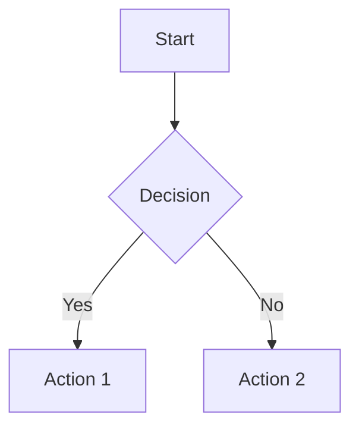

# MarkdownPlus Documentation

**Version:** 1.0.0  
**A multi-tab Markdown editor with live preview**

MarkdownPlus is a modern, feature-rich Markdown editor built with Electron, React, and Material UI (MUI). It provides a seamless editing experience with dual viewing modes, extensive keyboard shortcuts, and a clean, intuitive interface.

---

## Table of Contents

1. [Overview](#overview)
2. [Installation](#installation)
3. [Features](#features)
   - [Dual View Modes](#dual-view-modes)
   - [Multi-Tab Editing](#multi-tab-editing)
   - [File Operations](#file-operations)
   - [Find and Replace](#find-and-replace)
   - [Markdown Formatting Toolbar](#markdown-formatting-toolbar)
   - [reStructuredText Support](#restructuredtext-support)
   - [Mermaid Diagrams](#mermaid-diagrams)
   - [Link Navigation](#link-navigation)
   - [Theme Support](#theme-support)
   - [Visual Configuration Menu](#visual-configuration-menu)
   - [Logging](#logging)
4. [AI Features](#ai-features)
   - [AI Chat Assistant](#ai-chat-assistant)
   - [AI Edit Mode](#ai-edit-mode)
   - [AI Inline Edit Window](#ai-inline-edit-window)
   - [AI Provider Configuration](#ai-provider-configuration)
5. [Keyboard Shortcuts](#keyboard-shortcuts)
6. [Supported File Formats](#supported-file-formats)
7. [Technical Architecture](#technical-architecture)
8. [Building from Source](#building-from-source)

---

## Overview

MarkdownPlus is a desktop Markdown editor designed for writers, developers, and anyone who works with Markdown documents. It features:

- **Dual viewing modes** - Switch between raw Markdown editing and rendered preview
- **Multi-tab interface** - Work on multiple documents simultaneously
- **GitHub Flavored Markdown** - Full GFM support including tables, task lists, and strikethrough
- **reStructuredText support** - Full RST rendering with dedicated formatting toolbar
- **Mermaid diagrams** - Embedded diagram support in both Markdown and RST files
- **Modern UI** - Built with Material UI for a clean, responsive interface
- **Cross-platform** - Available for Windows, macOS, and Linux

---

## Installation

### Pre-built Binaries

Download the appropriate installer for your platform from the releases page:

- **Windows:** `MarkdownPlus-Setup.exe` (installer) or `MarkdownPlus-Portable.exe` (portable)
- **macOS:** `MarkdownPlus.dmg`
- **Linux:** `MarkdownPlus.AppImage` or `MarkdownPlus.deb`

### File Associations

MarkdownPlus automatically registers as the default handler for markup files:

**Markdown:**
- `.md`, `.markdown`, `.mdown`, `.mkd`, `.mkdn`, `.mdx`, `.mdwn`

**reStructuredText:**
- `.rst`, `.rest`

Double-clicking any of these file types will open them in MarkdownPlus.

---

## Features

### Dual View Modes

MarkdownPlus provides two viewing modes for each document:

#### Edit Mode
- Raw Markdown text editing with a monospace font
- Syntax-aware editing (list continuation, code block handling)
- Full formatting toolbar access
- Real-time content updates

#### Preview Mode
- Rendered Markdown output
- Styled with proper typography and formatting
- Support for all GFM elements (tables, task lists, code blocks)
- Word highlighting on double-click

**Toggle between modes:**
- Click the mode icon on the tab
- Use keyboard shortcut `Ctrl+E`

### Multi-Tab Editing

Work on multiple documents simultaneously with the tabbed interface:

- **Open multiple files** - Each file opens in its own tab
- **Drag-and-drop reordering** - Reorganize tabs by dragging
- **Tab context menu** - Right-click for additional options:
  - Rename file
  - Open file location in explorer
- **Unsaved indicator** - Yellow icon shows files with unsaved changes
- **Per-tab view mode** - Each tab remembers its edit/preview state
- **Scroll position memory** - Maintains scroll position when switching tabs or modes

### File Operations

Access file operations through the toolbar or keyboard shortcuts:

| Operation | Toolbar Icon | Description |
|-----------|--------------|-------------|
| New File | ➕ | Create a new untitled document |
| Open File | 📁 | Open existing file(s) with multi-select support |
| Save | 💾 | Save current file (prompts for name if untitled) |
| Save All | 💾+ | Save all files with unsaved changes |
| Close | ✕ | Close current tab (prompts to save if dirty) |
| Close All | ✕✕ | Close all open tabs |

**Additional operations:**
- **Save As** - Save with a new filename (via menu)
- **Show in Folder** - Reveal file in system file explorer
- **Rename** - Rename file from tab context menu

### Find and Replace

Powerful search functionality accessible in both Edit and Preview modes:

#### Find Tab (`Ctrl+F`)
- **Find Next** - Navigate to the next occurrence
- **Count** - Display total number of matches
- **Highlighting** - All matches highlighted in the document
- **Current match indicator** - Active match shown in distinct color

#### Replace Tab (`Ctrl+H`)
- **Replace** - Replace current match and move to next
- **Replace All** - Replace all occurrences at once
- **Match counter** - Shows "X of Y matches" during navigation

> **Note:** Replace operations are only available in Edit mode. In Preview mode, the Replace buttons are disabled with a helpful tooltip.

### Markdown Formatting Toolbar

In Edit mode, a comprehensive formatting toolbar provides quick access to Markdown syntax:

#### Text Formatting
| Button | Markdown | Shortcut |
|--------|----------|----------|
| Bold | `**text**` | `Ctrl+B` |
| Italic | `*text*` | `Ctrl+I` |
| Strikethrough | `~~text~~` | - |

#### Headings
| Button | Markdown |
|--------|----------|
| H1 | `# Heading` |
| H2 | `## Heading` |
| H3 | `### Heading` |

#### Code
| Button | Markdown |
|--------|----------|
| Inline Code | `` `code` `` |
| Code Block | ` ```code``` ` |

#### Lists & Structure
| Button | Markdown |
|--------|----------|
| Bulleted List | `- item` |
| Numbered List | `1. item` |
| Task List | `- [ ] task` |
| Quote | `> quote` |

#### Links & Media
| Button | Markdown |
|--------|----------|
| Link | `[text](url)` |
| Image | `` |

#### Other
| Button | Markdown |
|--------|----------|
| Table | Inserts table template |
| Horizontal Rule | `---` |

#### History
| Button | Shortcut |
|--------|----------|
| Undo | `Ctrl+Z` |
| Redo | `Ctrl+Y` or `Ctrl+Shift+Z` |

### reStructuredText Support

MarkdownPlus provides full support for reStructuredText (RST) files with live preview rendering and a dedicated formatting toolbar.

#### Supported RST Elements

| Element | Syntax | Description |
|---------|--------|-------------|
| **Headings** | Text with underlines (`=`, `-`, `~`, `^`) | Multiple heading levels supported |
| **Bold** | `**text**` | Strong emphasis |
| **Italic** | `*text*` | Emphasis |
| **Inline Code** | ``` ``code`` ``` | Monospace inline text |
| **Code Blocks** | `.. code-block:: language` | Syntax-highlighted code |
| **Bullet Lists** | `* item` or `- item` | Unordered lists |
| **Numbered Lists** | `#. item` or `1. item` | Auto-numbered or explicit |
| **Links** | ``` `text <url>`_ ``` | Inline hyperlinks |
| **Images** | `.. image:: url` | Image embedding |
| **Block Quotes** | Indented text | Quoted content |
| **Literal Blocks** | `::` followed by indented text | Preformatted text |
| **Admonitions** | `.. note::`, `.. warning::`, etc. | Callout boxes |
| **Horizontal Rules** | `----` | Section dividers |

#### RST Formatting Toolbar

When editing RST files, a specialized toolbar appears with RST-specific formatting buttons:

| Button | Action | RST Syntax |
|--------|--------|------------|
| Bold | Insert bold text | `**text**` |
| Italic | Insert italic text | `*text*` |
| H1 | Heading with `=` underline | `Title` + `====` |
| H2 | Heading with `-` underline | `Title` + `----` |
| H3 | Heading with `~` underline | `Title` + `~~~~` |
| Code | Inline code | ``` ``code`` ``` |
| Code Block | Code block directive | `.. code-block::` |
| Quote | Block quote | Indented text |
| Bullet List | Unordered list item | `* item` |
| Numbered List | Auto-numbered item | `#. item` |
| Link | Inline link | ``` `text <url>`_ ``` |
| Image | Image directive | `.. image:: url` |
| Note | Note admonition | `.. note::` |
| Warning | Warning admonition | `.. warning::` |
| Horizontal Rule | Section divider | `----` |

### Mermaid Diagrams

MarkdownPlus supports embedded Mermaid diagrams in both Markdown and RST files. Diagrams are rendered live in preview mode.

#### Mermaid in Markdown

Use fenced code blocks with the `mermaid` language identifier:

````markdown

````

#### Mermaid in RST

Use the `code-block` directive with `mermaid` as the language:

```rst
.. code-block:: mermaid

   graph TD
       A[Start] --> B{Decision}
       B -->|Yes| C[Action 1]
       B -->|No| D[Action 2]
```

#### Supported Diagram Types

| Type | Description |
|------|-------------|
| Flowchart | `graph TD` or `graph LR` - Flow diagrams |
| Sequence | `sequenceDiagram` - Interaction sequences |
| Class | `classDiagram` - UML class diagrams |
| State | `stateDiagram-v2` - State machines |
| ER Diagram | `erDiagram` - Entity relationships |
| Gantt | `gantt` - Project timelines |
| Pie Chart | `pie` - Pie charts |
| Git Graph | `gitGraph` - Git branch visualization |

### Link Navigation

MarkdownPlus supports clickable link navigation in Preview mode, allowing you to follow both internal and external links directly from the rendered document.

#### Supported Link Types

| Link Type | Example | Behavior |
|-----------|---------|----------|
| **Internal anchors** | `[Section](#section-name)` | Smooth scrolls to the target heading |
| **External URLs** | `[Website](https://example.com)` | Opens in your default browser |

#### Internal Anchor Links

Clicking a link that starts with `#` navigates to the matching heading within the document:

- Headings automatically generate anchor IDs using a GitHub-style slug format (lowercase, spaces become hyphens, special characters removed)
- Example: A heading `## My Section Title` generates the ID `my-section-title`
- Clicking `[Go to section](#my-section-title)` smoothly scrolls the preview to that heading

#### External URLs

Clicking a link that starts with `http://` or `https://` opens the URL in your system's default web browser. The link opens externally so you stay in MarkdownPlus without interruption.

> **Note:** Link navigation is available in Preview mode only. In Edit mode, links are displayed as raw Markdown syntax.

### Theme Support

MarkdownPlus supports both light and dark themes:

- **Toggle Theme** - Click the sun/moon icon in the toolbar
- **Persistent preference** - Theme choice is remembered across sessions
- **Full UI theming** - All UI elements adapt to the selected theme

### Visual Configuration Menu

MarkdownPlus provides a visual Settings dialog for configuring the application without manually editing files.

#### Opening the Settings Dialog

- Click the **Settings** (gear) icon in the toolbar
- Use the keyboard shortcut `Ctrl+,` (Ctrl+Comma)

#### Dialog Interface

The Settings dialog is a draggable modal window with the following characteristics:

- **Draggable header** - Reposition the dialog by dragging the title bar
- **Scrollable content** - All settings are accessible within a scrollable area
- **Auto-save** - Changes are saved automatically with a brief "Saving..." indicator
- **Close options** - Close via the X button, `Escape` key, or clicking outside the dialog

#### Settings Sections

##### Basic Settings

| Setting | Control | Description |
|---------|---------|-------------|
| **Default Line Ending** | Dropdown | Choose between `CRLF` (Windows) or `LF` (Unix/Mac) for new files |
| **Developer Tools** | Toggle switch | Enable or disable DevTools on application launch |
| **Silent File Updates** | Toggle switch | When enabled, externally modified files are reloaded automatically in place. When disabled, you are prompted before refreshing |

##### AI API Keys

Securely manage API keys for AI providers:

| Provider | Features |
|----------|----------|
| **xAI (Grok)** | Set or clear API key |
| **Anthropic Claude** | Set or clear API key |
| **OpenAI** | Set or clear API key |

- API keys are stored securely using the operating system's credential storage
- Password-masked input fields protect key visibility
- A green **"Set"** chip indicates when a key is configured
- Use the **Set** button to save a key or the **Clear** button to remove it

##### AI Models

- Displays available models for each configured provider in collapsible accordion sections
- Enable or disable individual models with checkboxes
- Only providers with configured API keys are shown
- Model names are formatted for readability (e.g., `grok-beta` displays as "Grok Beta")

##### Reference Information

- **Recent Files** - Table showing recently opened files and their view modes
- **Open Files** - Table showing currently open files and their view modes

#### Configuration Storage

MarkdownPlus stores its configuration in `config.json` located in the user data directory:

- **Windows:** `C:\Users\<user>\AppData\Roaming\markdownplus\config.json`
- **macOS:** `~/Library/Application Support/markdownplus/config.json`
- **Linux:** `~/.config/markdownplus/config.json`

Settings are preserved across application updates and reinstalls. While direct editing of `config.json` is still supported, the visual Settings dialog is the recommended approach.

### Logging

MarkdownPlus maintains a debug log file for troubleshooting:

- **Location:** `markdownplus-debug.log` (next to executable)
- **View Log:** Click the document icon in the toolbar
- **Content:** Timestamped entries for app events, IPC calls, and errors

The log file is cleared on each application start to prevent excessive growth.

#### Console Logging

All console output from the renderer process is captured and written to the log file, prefixed with:
- `[RENDERER LOG]`
- `[RENDERER WARN]`
- `[RENDERER ERROR]`
- `[RENDERER INFO]`

---

## AI Features

MarkdownPlus includes integrated AI capabilities to assist with writing and editing your documents. The AI features support multiple providers including Claude (Anthropic), OpenAI, and xAI.

### AI Chat Assistant

Access the AI Chat Assistant by clicking the **AI** button in the toolbar. The chat assistant provides a conversational interface for getting help with your documents.

#### Features
- **Multi-provider support** - Choose between Claude, OpenAI, or xAI
- **Dynamic model selection** - Available models are fetched from each provider
- **File attachments** - Attach files for context in your conversations
- **Context documents** - Add reference files that persist across messages
- **Persistent chat history** - Conversations are maintained during your session
- **Draggable dialog** - Position the chat window anywhere on screen
- **Resizable interface** - Adjust the dialog size to your preference
- **Collapsible design** - Minimize the dialog when not in use

#### Using the Chat Assistant
1. Click the **AI** button in the toolbar to open the chat dialog
2. Select your preferred AI provider from the dropdown
3. Choose a model from the available options
4. Type your question or request in the input field
5. Press **Enter** or click **Send** to submit

#### Attaching Files
- Click the **attachment** icon to add files for context
- Drag and drop files directly into the chat dialog
- Toggle context documents on/off without removing them

### AI Edit Mode

AI Edit Mode allows you to make AI-powered edits directly to your document with a visual diff review system.

#### Enabling Edit Mode
1. Open the AI Chat dialog
2. Click the **pencil icon** next to the model selector to toggle Edit Mode
3. The button turns green when Edit Mode is active

> **Note:** Edit Mode is only available with Claude and OpenAI providers. xAI shows an "Edit N/A" badge indicating it doesn't support structured output required for edit mode.

#### Making Edits
1. With Edit Mode enabled, describe the changes you want in natural language
2. Examples:
   - "Add a table of contents at the beginning"
   - "Fix the grammar in paragraph 3"
   - "Convert the bullet list to a numbered list"
   - "Add code examples for each function"
3. Press **Enter** to submit the edit request

#### Reviewing Changes
When the AI returns edits, a visual diff view appears in the editor:

- **Green highlights** - New content being added
- **Red strikethrough** - Content being removed/replaced
- **Navigation toolbar** - Appears in the bottom-right corner

#### Diff Navigation Controls
| Control | Description |
|---------|-------------|
| **< >** arrows | Navigate between changes |
| **Accept** (checkmark) | Accept the current change |
| **Reject** (X) | Reject the current change |
| **Accept All** | Accept all pending changes |
| **Cancel** | Discard all changes and exit diff mode |

#### Diff Keyboard Shortcuts
| Shortcut | Action |
|----------|--------|
| `J` or `↓` | Navigate to next change |
| `K` or `↑` | Navigate to previous change |
| `Enter` or `Y` | Accept current change |
| `Backspace` or `N` | Reject current change |
| `Ctrl+Shift+A` | Accept all changes |
| `Escape` | Cancel and discard all changes |

### AI Inline Edit Window

The AI Inline Edit Window provides a streamlined interface for making AI-powered edits directly within your document. It combines the AI Chat dialog with an inline editing workflow, allowing you to describe changes in natural language and review them visually in the editor.

#### Opening the Inline Edit Window

1. Press `Ctrl+Shift+A` or click the **AI** button (robot icon) in the toolbar
2. The AI dialog opens as a floating, draggable window overlaying the editor
3. Click the **pencil icon** next to the model selector to activate Edit Mode
4. The button turns green, and the input placeholder changes to "Describe the changes you want..."

#### Window Behavior

| Feature | Description |
|---------|-------------|
| **Draggable** | Reposition the window by dragging the header |
| **Resizable** | Drag the bottom-right corner to resize |
| **Collapsible** | Minimize the window when not actively editing |
| **Focus opacity** | Window is fully opaque when focused, semi-transparent when not |
| **Persistent position** | Window maintains its position while you work |

#### Inline Edit Workflow

1. **Select context** - The current document is automatically attached as context
2. **Describe changes** - Type a natural language description of the edits you want
3. **Submit** - Press `Enter` or click the green **Edit** button to submit
4. **Review** - A visual diff appears directly in the editor with:
   - **Green highlights** for new content being added
   - **Red strikethrough** for content being removed or replaced
5. **Navigate and decide** - Use the diff navigation toolbar to accept or reject individual changes

#### Edit Mode vs. Chat Mode

| Aspect | Chat Mode | Edit Mode |
|--------|-----------|-----------|
| **Purpose** | Ask questions, get suggestions | Apply changes directly to document |
| **Input prompt** | "Type a message..." | "Describe the changes you want..." |
| **Send button** | Blue with send icon | Green with edit icon |
| **Result** | Chat response in dialog | Visual diff in the editor |
| **Provider support** | All providers | Claude and OpenAI only |

> **Note:** Edit Mode is only available with Claude and OpenAI providers. xAI displays an "Edit N/A" badge as it does not support the structured output required for inline edits.

### AI Provider Configuration

Configure your AI providers by setting up API keys through the Settings dialog.

#### Supported Providers

| Provider | Models | Edit Mode Support |
|----------|--------|-------------------|
| **Claude** (Anthropic) | Claude 3.5 Sonnet, Claude 3 Opus, etc. | Yes |
| **OpenAI** | GPT-4, GPT-4 Turbo, GPT-3.5, etc. | Yes |
<!-- | **xAI** | Grok models | Chat only | -->

#### Setting Up API Keys

API keys are managed through the Settings dialog:

1. Click the **Settings** (gear) icon in the toolbar or press `Ctrl+,`
2. Navigate to the **AI API Keys** section
3. Enter your API keys for each provider:
   - **Anthropic Claude** - For Claude models
   - **OpenAI** - For GPT models
4. Click **Set** to save each key securely

API keys are encrypted and stored securely using your operating system's credential storage:
- **Windows**: DPAPI (Data Protection API)
- **macOS**: Keychain
- **Linux**: libsecret

#### Development Override (.env file)

For development purposes, you can use a `.env` file to override secure storage:

1. Copy `.env.example` to `.env` in the project root
2. Add your API keys:
   ```
   ANTHROPIC_API_KEY=your_key_here
   OPENAI_API_KEY=your_key_here
   XAI_API_KEY=your_key_here
   ```
3. Restart the application

> **Note**: The `.env` file is for development only and takes precedence over secure storage when present. In production builds (installers), secure storage is always used.

#### Provider Status Indicators

The AI Chat dialog shows the status of each provider:
- **Green indicator** - Provider is configured and available
- **Red indicator** - Provider is not configured (missing API key)

---

## Keyboard Shortcuts

### File Operations
| Shortcut | Action |
|----------|--------|
| `Ctrl+N` | New file |
| `Ctrl+O` | Open file |
| `Ctrl+S` | Save file |
| `Ctrl+Shift+S` | Save all files |
| `Ctrl+W` | Close current file |

### Editing
| Shortcut | Action |
|----------|--------|
| `Ctrl+Z` | Undo |
| `Ctrl+Y` | Redo |
| `Ctrl+Shift+Z` | Redo (alternative) |
| `Ctrl+B` | Bold |
| `Ctrl+I` | Italic |
| `Tab` | Insert 4 spaces |

### Navigation
| Shortcut | Action |
|----------|--------|
| `Ctrl+E` | Toggle Edit/Preview mode |
| `Ctrl+F` | Open Find dialog |
| `Ctrl+H` | Open Find and Replace dialog |
| `Ctrl+,` | Open Settings dialog |
| `Enter` | In Find dialog: Find Next |
| `Escape` | Close Find dialog |

### List Editing (Smart Continuation)
When editing lists, pressing `Enter` automatically continues the list:

- **Numbered lists:** Increments the number (`1. → 2. → 3.`)
- **Bulleted lists:** Continues with same bullet (`- → -`)
- **Task lists:** Creates new unchecked task (`- [ ] → - [ ]`)

### AI Shortcuts
| Shortcut | Action |
|----------|--------|
| `Ctrl+Shift+A` | Open/close AI Chat dialog |
| `Enter` | Send message or submit edit (in AI dialog) |
| `Shift+Enter` | New line in AI dialog input |

### AI Edit Mode Navigation
| Shortcut | Action |
|----------|--------|
| `J` or `↓` | Navigate to next change |
| `K` or `↑` | Navigate to previous change |
| `Enter` or `Y` | Accept current change |
| `Backspace` or `N` | Reject current change |
| `Ctrl+Shift+A` | Accept all changes |
| `Escape` | Cancel diff session |

---

## Supported File Formats

### Markup Files (Full Support)
| Extension | Type | Features |
|-----------|------|----------|
| `.md` | Markdown | Full GFM rendering, Mermaid diagrams |
| `.markdown` | Markdown | Full GFM rendering, Mermaid diagrams |
| `.mdown` | Markdown | Full GFM rendering, Mermaid diagrams |
| `.mkd` | Markdown | Full GFM rendering, Mermaid diagrams |
| `.mkdn` | Markdown | Full GFM rendering, Mermaid diagrams |
| `.mdx` | MDX | Full GFM rendering, Mermaid diagrams |
| `.mdwn` | Markdown | Full GFM rendering, Mermaid diagrams |
| `.rst` | reStructuredText | Full RST rendering, Mermaid diagrams |
| `.rest` | reStructuredText | Full RST rendering, Mermaid diagrams |

### Text Files
| Extension | Type |
|-----------|------|
| `.txt` | Plain text |

### Best-Effort Support
These formats can be opened but may not render correctly in preview:
| Extension | Type |
|-----------|------|
| `.adoc` | AsciiDoc |
| `.asciidoc` | AsciiDoc |
| `.org` | Org-mode |
| `.textile` | Textile |

> A warning notification appears when opening files that may not fully support preview rendering.

---

## Technical Architecture

### Technology Stack

| Component | Technology |
|-----------|------------|
| **Runtime** | Electron 36.x |
| **UI Framework** | React 19.x |
| **Component Library** | Material UI (MUI) 7.x |
| **Markdown Rendering** | react-markdown with remark-gfm |
| **RST Rendering** | Custom parser with React components |
| **Diagrams** | Mermaid |
| **Diff Engine** | diff (npm package) |
| **AI Providers** | Claude API, OpenAI API, xAI API |
| **Language** | TypeScript |
| **Build Tool** | Webpack |
| **Package Manager** | npm |

### Project Structure

```
src/
├── main/                    # Electron main process
│   ├── main.ts             # Application entry, IPC handlers
│   ├── preload.ts          # Context bridge API
│   ├── logger.ts           # Debug logging system
│   ├── aiIpcHandlers.ts    # AI-related IPC handlers
│   └── services/           # Backend services
│       ├── claudeApi.ts    # Anthropic Claude API integration
│       ├── openaiApi.ts    # OpenAI API integration
│       └── xaiApi.ts       # xAI API integration
│
├── renderer/               # React application
│   ├── App.tsx            # Root component
│   ├── components/        # UI components
│   │   ├── EditorPane.tsx      # Main editor with edit/preview
│   │   ├── TabBar.tsx          # Tab management
│   │   ├── Toolbar.tsx         # Main application toolbar
│   │   ├── MarkdownToolbar.tsx # Markdown formatting toolbar
│   │   ├── RstToolbar.tsx      # RST formatting toolbar
│   │   ├── RstRenderer.tsx     # reStructuredText parser/renderer
│   │   ├── MermaidDiagram.tsx  # Mermaid diagram renderer
│   │   ├── AIChatDialog.tsx    # AI chat interface
│   │   ├── DiffNavigationToolbar.tsx  # Diff review controls
│   │   ├── DiffHunkControl.tsx # Per-hunk accept/reject controls
│   │   ├── FindReplaceDialog.tsx
│   │   ├── SettingsDialog.tsx  # Settings configuration
│   │   ├── EmptyState.tsx
│   │   └── NotificationSnackbar.tsx
│   │
│   ├── contexts/          # React context providers
│   │   ├── EditorContext.tsx   # Editor state management
│   │   └── ThemeContext.tsx    # Theme management
│   │
│   ├── hooks/             # Custom React hooks
│   │   ├── useFileOperations.ts
│   │   ├── useWindowTitle.ts
│   │   ├── useExternalFileWatcher.ts  # External file change handling
│   │   ├── useAIChat.ts        # AI chat state management
│   │   └── useAIDiffEdit.ts    # AI diff editing logic
│   │
│   └── types/             # TypeScript type definitions
│       ├── index.ts
│       ├── global.d.ts         # Global type declarations
│       └── diffTypes.ts        # Diff-related types
│
└── styles/                # CSS styles
    └── index.css
```

### State Management

The application uses React Context with a reducer pattern for state management:

- **EditorContext** - Manages open files, active tab, undo/redo stacks
- **ThemeContext** - Manages light/dark theme preference

### IPC Communication

The main and renderer processes communicate through a secure IPC bridge:

```typescript
// File Operations
window.electronAPI.openFile()
window.electronAPI.saveFile(path, content)
window.electronAPI.loadConfig()

// AI Operations
window.electronAPI.aiChatRequest(messages, model, provider)
window.electronAPI.aiEditRequest(messages, model, provider)
window.electronAPI.getAvailableModels(provider)
window.electronAPI.getAIProviderStatus()

// Events (Main → Renderer)
onExternalFileChange(callback)
onOpenFilesFromArgs(callback)
```

---

## Building from Source

### Prerequisites

- Node.js 18.x or later
- npm 9.x or later

### Development

```bash
# Install dependencies
npm install

# Start in development mode (with hot reload)
npm run dev

# Or build and run
npm start
```

### Production Build

```bash
# Windows (NSIS installer + portable)
npm run package

# macOS
npm run package-mac

# Linux (AppImage + deb)
npm run package-linux
```

Build outputs are placed in the `release/` directory.

### Build Configuration

The build process is configured in `package.json` under the `build` key. Key settings include:

- **App ID:** `com.markdownplus.app`
- **File associations:** Automatic registration for Markdown file types
- **Windows targets:** NSIS installer and portable executable
- **macOS target:** DMG
- **Linux targets:** AppImage and Debian package

---

## Additional Features

### Word Highlighting

Double-click any word in the editor to highlight all occurrences:
- Works in both Edit and Preview modes
- Highlights are cleared on single click or when typing
- Uses distinct styling from search highlights

### External File Change Detection

When a file is modified outside of MarkdownPlus, the application detects the change in real-time via file system watching. The behavior depends on the **Silent File Updates** setting in Settings:

#### Silent File Updates ON (default)
- All externally modified files are automatically reloaded in place with no user interaction
- The `config.json` file is always auto-reloaded silently

#### Silent File Updates OFF
- A prompt dialog appears asking: *"Would you like to refresh it with the latest changes?"*
  - **Yes** - Refresh the file with the latest changes from disk
  - **No** - Keep your current content; saving will overwrite the external changes on disk
- The `config.json` file is always auto-reloaded regardless of this setting

### Line Ending Support

MarkdownPlus preserves line endings when saving files:
- Detects original line ending style (CRLF or LF)
- Maintains consistency throughout the file
- Defaults to platform-appropriate line endings for new files

### Single Instance Lock

Only one instance of MarkdownPlus runs at a time:
- Opening files while the app is running focuses the existing window
- New files are opened in tabs within the running instance

### Frameless Window

MarkdownPlus uses a custom frameless window:
- Draggable title bar area
- Custom minimize, maximize, and close buttons
- Consistent appearance across platforms

---

## Support

For issues, feature requests, or contributions, please visit the project repository.

---

*MarkdownPlus - Write Markdown, Beautifully.*
