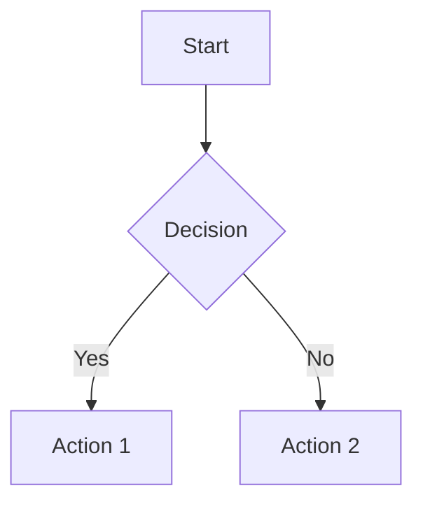

# MarkdownPlus Documentation

**Version:** 1.0.0  
**A multi-tab Markdown editor with live preview**

MarkdownPlus is a modern, feature-rich Markdown editor built with Electron, React, and Material UI (MUI). It provides a seamless editing experience with dual viewing modes, extensive keyboard shortcuts, and a clean, intuitive interface.

---

## Table of Contents

1. [Overview](#overview)
2. [Installation](#installation)
3. [Features](#features)
   - [Dual View Modes](#dual-view-modes)
   - [Multi-Tab Editing](#multi-tab-editing)
   - [File Operations](#file-operations)
   - [Find and Replace](#find-and-replace)
   - [Markdown Formatting Toolbar](#markdown-formatting-toolbar)
   - [reStructuredText Support](#restructuredtext-support)
   - [Mermaid Diagrams](#mermaid-diagrams)
   - [Theme Support](#theme-support)
   - [Configuration](#configuration)
   - [Logging](#logging)
4. [Keyboard Shortcuts](#keyboard-shortcuts)
5. [Supported File Formats](#supported-file-formats)
6. [Technical Architecture](#technical-architecture)
7. [Building from Source](#building-from-source)

---

## Overview

MarkdownPlus is a desktop Markdown editor designed for writers, developers, and anyone who works with Markdown documents. It features:

- **Dual viewing modes** - Switch between raw Markdown editing and rendered preview
- **Multi-tab interface** - Work on multiple documents simultaneously
- **GitHub Flavored Markdown** - Full GFM support including tables, task lists, and strikethrough
- **reStructuredText support** - Full RST rendering with dedicated formatting toolbar
- **Mermaid diagrams** - Embedded diagram support in both Markdown and RST files
- **Modern UI** - Built with Material UI for a clean, responsive interface
- **Cross-platform** - Available for Windows, macOS, and Linux

---

## Installation

### Pre-built Binaries

Download the appropriate installer for your platform from the releases page:

- **Windows:** `MarkdownPlus-Setup.exe` (installer) or `MarkdownPlus-Portable.exe` (portable)
- **macOS:** `MarkdownPlus.dmg`
- **Linux:** `MarkdownPlus.AppImage` or `MarkdownPlus.deb`

### File Associations

MarkdownPlus automatically registers as the default handler for markup files:

**Markdown:**
- `.md`, `.markdown`, `.mdown`, `.mkd`, `.mkdn`, `.mdx`, `.mdwn`

**reStructuredText:**
- `.rst`, `.rest`

Double-clicking any of these file types will open them in MarkdownPlus.

---

## Features

### Dual View Modes

MarkdownPlus provides two viewing modes for each document:

#### Edit Mode
- Raw Markdown text editing with a monospace font
- Syntax-aware editing (list continuation, code block handling)
- Full formatting toolbar access
- Real-time content updates

#### Preview Mode
- Rendered Markdown output
- Styled with proper typography and formatting
- Support for all GFM elements (tables, task lists, code blocks)
- Word highlighting on double-click

**Toggle between modes:**
- Click the mode icon on the tab
- Use keyboard shortcut `Ctrl+E`

### Multi-Tab Editing

Work on multiple documents simultaneously with the tabbed interface:

- **Open multiple files** - Each file opens in its own tab
- **Drag-and-drop reordering** - Reorganize tabs by dragging
- **Tab context menu** - Right-click for additional options:
  - Rename file
  - Open file location in explorer
- **Unsaved indicator** - Yellow icon shows files with unsaved changes
- **Per-tab view mode** - Each tab remembers its edit/preview state
- **Scroll position memory** - Maintains scroll position when switching tabs or modes

### File Operations

Access file operations through the toolbar or keyboard shortcuts:

| Operation | Toolbar Icon | Description |
|-----------|--------------|-------------|
| New File | ➕ | Create a new untitled document |
| Open File | 📁 | Open existing file(s) with multi-select support |
| Save | 💾 | Save current file (prompts for name if untitled) |
| Save All | 💾+ | Save all files with unsaved changes |
| Close | ✕ | Close current tab (prompts to save if dirty) |
| Close All | ✕✕ | Close all open tabs |

**Additional operations:**
- **Save As** - Save with a new filename (via menu)
- **Show in Folder** - Reveal file in system file explorer
- **Rename** - Rename file from tab context menu

### Find and Replace

Powerful search functionality accessible in both Edit and Preview modes:

#### Find Tab (`Ctrl+F`)
- **Find Next** - Navigate to the next occurrence
- **Count** - Display total number of matches
- **Highlighting** - All matches highlighted in the document
- **Current match indicator** - Active match shown in distinct color

#### Replace Tab (`Ctrl+H`)
- **Replace** - Replace current match and move to next
- **Replace All** - Replace all occurrences at once
- **Match counter** - Shows "X of Y matches" during navigation

> **Note:** Replace operations are only available in Edit mode. In Preview mode, the Replace buttons are disabled with a helpful tooltip.

### Markdown Formatting Toolbar

In Edit mode, a comprehensive formatting toolbar provides quick access to Markdown syntax:

#### Text Formatting
| Button | Markdown | Shortcut |
|--------|----------|----------|
| Bold | `**text**` | `Ctrl+B` |
| Italic | `*text*` | `Ctrl+I` |
| Strikethrough | `~~text~~` | - |

#### Headings
| Button | Markdown |
|--------|----------|
| H1 | `# Heading` |
| H2 | `## Heading` |
| H3 | `### Heading` |

#### Code
| Button | Markdown |
|--------|----------|
| Inline Code | `` `code` `` |
| Code Block | ` ```code``` ` |

#### Lists & Structure
| Button | Markdown |
|--------|----------|
| Bulleted List | `- item` |
| Numbered List | `1. item` |
| Task List | `- [ ] task` |
| Quote | `> quote` |

#### Links & Media
| Button | Markdown |
|--------|----------|
| Link | `[text](url)` |
| Image | `` |

#### Other
| Button | Markdown |
|--------|----------|
| Table | Inserts table template |
| Horizontal Rule | `---` |

#### History
| Button | Shortcut |
|--------|----------|
| Undo | `Ctrl+Z` |
| Redo | `Ctrl+Y` or `Ctrl+Shift+Z` |

### reStructuredText Support

MarkdownPlus provides full support for reStructuredText (RST) files with live preview rendering and a dedicated formatting toolbar.

#### Supported RST Elements

| Element | Syntax | Description |
|---------|--------|-------------|
| **Headings** | Text with underlines (`=`, `-`, `~`, `^`) | Multiple heading levels supported |
| **Bold** | `**text**` | Strong emphasis |
| **Italic** | `*text*` | Emphasis |
| **Inline Code** | ``` ``code`` ``` | Monospace inline text |
| **Code Blocks** | `.. code-block:: language` | Syntax-highlighted code |
| **Bullet Lists** | `* item` or `- item` | Unordered lists |
| **Numbered Lists** | `#. item` or `1. item` | Auto-numbered or explicit |
| **Links** | ``` `text <url>`_ ``` | Inline hyperlinks |
| **Images** | `.. image:: url` | Image embedding |
| **Block Quotes** | Indented text | Quoted content |
| **Literal Blocks** | `::` followed by indented text | Preformatted text |
| **Admonitions** | `.. note::`, `.. warning::`, etc. | Callout boxes |
| **Horizontal Rules** | `----` | Section dividers |

#### RST Formatting Toolbar

When editing RST files, a specialized toolbar appears with RST-specific formatting buttons:

| Button | Action | RST Syntax |
|--------|--------|------------|
| Bold | Insert bold text | `**text**` |
| Italic | Insert italic text | `*text*` |
| H1 | Heading with `=` underline | `Title` + `====` |
| H2 | Heading with `-` underline | `Title` + `----` |
| H3 | Heading with `~` underline | `Title` + `~~~~` |
| Code | Inline code | ``` ``code`` ``` |
| Code Block | Code block directive | `.. code-block::` |
| Quote | Block quote | Indented text |
| Bullet List | Unordered list item | `* item` |
| Numbered List | Auto-numbered item | `#. item` |
| Link | Inline link | ``` `text <url>`_ ``` |
| Image | Image directive | `.. image:: url` |
| Note | Note admonition | `.. note::` |
| Warning | Warning admonition | `.. warning::` |
| Horizontal Rule | Section divider | `----` |

### Mermaid Diagrams

MarkdownPlus supports embedded Mermaid diagrams in both Markdown and RST files. Diagrams are rendered live in preview mode.

#### Mermaid in Markdown

Use fenced code blocks with the `mermaid` language identifier:

````markdown

````

#### Mermaid in RST

Use the `code-block` directive with `mermaid` as the language:

```rst
.. code-block:: mermaid

   graph TD
       A[Start] --> B{Decision}
       B -->|Yes| C[Action 1]
       B -->|No| D[Action 2]
```

#### Supported Diagram Types

| Type | Description |
|------|-------------|
| Flowchart | `graph TD` or `graph LR` - Flow diagrams |
| Sequence | `sequenceDiagram` - Interaction sequences |
| Class | `classDiagram` - UML class diagrams |
| State | `stateDiagram-v2` - State machines |
| ER Diagram | `erDiagram` - Entity relationships |
| Gantt | `gantt` - Project timelines |
| Pie Chart | `pie` - Pie charts |
| Git Graph | `gitGraph` - Git branch visualization |

### Theme Support

MarkdownPlus supports both light and dark themes:

- **Toggle Theme** - Click the sun/moon icon in the toolbar
- **Persistent preference** - Theme choice is remembered across sessions
- **Full UI theming** - All UI elements adapt to the selected theme

### Configuration

MarkdownPlus stores its configuration in `config.json` located in the user data directory:

- **Windows:** `C:\Users\<user>\AppData\Roaming\markdownplus\config.json`
- **macOS:** `~/Library/Application Support/markdownplus/config.json`
- **Linux:** `~/.config/markdownplus/config.json`

This location ensures your settings are preserved across application updates and reinstalls.

#### Configuration Options

```json
{
  "recentFiles": [],
  "openFiles": [],
  "defaultLineEnding": "CRLF",
  "devToolsOpen": false
}
```

| Option | Description |
|--------|-------------|
| `recentFiles` | List of recently opened files with their view modes |
| `openFiles` | Files to restore on next launch |
| `defaultLineEnding` | Default line ending for new files (`CRLF` or `LF`) |
| `devToolsOpen` | Whether DevTools should open on launch |

#### Editing Configuration
1. Click the **Settings** (gear) icon in the toolbar
2. The `config.json` file opens in the editor
3. Make changes and save
4. Changes take effect immediately for applicable settings

### Logging

MarkdownPlus maintains a debug log file for troubleshooting:

- **Location:** `markdownplus-debug.log` (next to executable)
- **View Log:** Click the document icon in the toolbar
- **Content:** Timestamped entries for app events, IPC calls, and errors

The log file is cleared on each application start to prevent excessive growth.

#### Console Logging

All console output from the renderer process is captured and written to the log file, prefixed with:
- `[RENDERER LOG]`
- `[RENDERER WARN]`
- `[RENDERER ERROR]`
- `[RENDERER INFO]`

---

## Keyboard Shortcuts

### File Operations
| Shortcut | Action |
|----------|--------|
| `Ctrl+N` | New file |
| `Ctrl+O` | Open file |
| `Ctrl+S` | Save file |
| `Ctrl+Shift+S` | Save all files |
| `Ctrl+W` | Close current file |

### Editing
| Shortcut | Action |
|----------|--------|
| `Ctrl+Z` | Undo |
| `Ctrl+Y` | Redo |
| `Ctrl+Shift+Z` | Redo (alternative) |
| `Ctrl+B` | Bold |
| `Ctrl+I` | Italic |
| `Tab` | Insert 4 spaces |

### Navigation
| Shortcut | Action |
|----------|--------|
| `Ctrl+E` | Toggle Edit/Preview mode |
| `Ctrl+F` | Open Find dialog |
| `Ctrl+H` | Open Find and Replace dialog |
| `Enter` | In Find dialog: Find Next |
| `Escape` | Close Find dialog |

### List Editing (Smart Continuation)
When editing lists, pressing `Enter` automatically continues the list:

- **Numbered lists:** Increments the number (`1. → 2. → 3.`)
- **Bulleted lists:** Continues with same bullet (`- → -`)
- **Task lists:** Creates new unchecked task (`- [ ] → - [ ]`)

---

## Supported File Formats

### Markup Files (Full Support)
| Extension | Type | Features |
|-----------|------|----------|
| `.md` | Markdown | Full GFM rendering, Mermaid diagrams |
| `.markdown` | Markdown | Full GFM rendering, Mermaid diagrams |
| `.mdown` | Markdown | Full GFM rendering, Mermaid diagrams |
| `.mkd` | Markdown | Full GFM rendering, Mermaid diagrams |
| `.mkdn` | Markdown | Full GFM rendering, Mermaid diagrams |
| `.mdx` | MDX | Full GFM rendering, Mermaid diagrams |
| `.mdwn` | Markdown | Full GFM rendering, Mermaid diagrams |
| `.rst` | reStructuredText | Full RST rendering, Mermaid diagrams |
| `.rest` | reStructuredText | Full RST rendering, Mermaid diagrams |

### Text Files
| Extension | Type |
|-----------|------|
| `.txt` | Plain text |

### Best-Effort Support
These formats can be opened but may not render correctly in preview:
| Extension | Type |
|-----------|------|
| `.adoc` | AsciiDoc |
| `.asciidoc` | AsciiDoc |
| `.org` | Org-mode |
| `.textile` | Textile |

> A warning notification appears when opening files that may not fully support preview rendering.

---

## Technical Architecture

### Technology Stack

| Component | Technology |
|-----------|------------|
| **Runtime** | Electron 36.x |
| **UI Framework** | React 19.x |
| **Component Library** | Material UI (MUI) 7.x |
| **Markdown Rendering** | react-markdown with remark-gfm |
| **RST Rendering** | Custom parser with React components |
| **Diagrams** | Mermaid |
| **Language** | TypeScript |
| **Build Tool** | Webpack |
| **Package Manager** | npm |

### Project Structure

```
src/
├── main/                    # Electron main process
│   ├── main.ts             # Application entry, IPC handlers
│   ├── preload.ts          # Context bridge API
│   └── logger.ts           # Debug logging system
│
├── renderer/               # React application
│   ├── App.tsx            # Root component
│   ├── components/        # UI components
│   │   ├── EditorPane.tsx      # Main editor with edit/preview
│   │   ├── TabBar.tsx          # Tab management
│   │   ├── Toolbar.tsx         # Main application toolbar
│   │   ├── MarkdownToolbar.tsx # Markdown formatting toolbar
│   │   ├── RstToolbar.tsx      # RST formatting toolbar
│   │   ├── RstRenderer.tsx     # reStructuredText parser/renderer
│   │   ├── MermaidDiagram.tsx  # Mermaid diagram renderer
│   │   ├── FindReplaceDialog.tsx
│   │   ├── EmptyState.tsx
│   │   └── NotificationSnackbar.tsx
│   │
│   ├── contexts/          # React context providers
│   │   ├── EditorContext.tsx   # Editor state management
│   │   └── ThemeContext.tsx    # Theme management
│   │
│   ├── hooks/             # Custom React hooks
│   │   ├── useFileOperations.ts
│   │   └── useWindowTitle.ts
│   │
│   └── types/             # TypeScript type definitions
│
└── styles/                # CSS styles
    └── index.css
```

### State Management

The application uses React Context with a reducer pattern for state management:

- **EditorContext** - Manages open files, active tab, undo/redo stacks
- **ThemeContext** - Manages light/dark theme preference

### IPC Communication

The main and renderer processes communicate through a secure IPC bridge:

```typescript
// Renderer → Main
window.electronAPI.openFile()
window.electronAPI.saveFile(path, content)
window.electronAPI.loadConfig()

// Main → Renderer (events)
onExternalFileChange(callback)
onOpenFilesFromArgs(callback)
```

---

## Building from Source

### Prerequisites

- Node.js 18.x or later
- npm 9.x or later

### Development

```bash
# Install dependencies
npm install

# Start in development mode (with hot reload)
npm run dev

# Or build and run
npm start
```

### Production Build

```bash
# Windows (NSIS installer + portable)
npm run package

# macOS
npm run package-mac

# Linux (AppImage + deb)
npm run package-linux
```

Build outputs are placed in the `release/` directory.

### Build Configuration

The build process is configured in `package.json` under the `build` key. Key settings include:

- **App ID:** `com.markdownplus.app`
- **File associations:** Automatic registration for Markdown file types
- **Windows targets:** NSIS installer and portable executable
- **macOS target:** DMG
- **Linux targets:** AppImage and Debian package

---

## Additional Features

### Word Highlighting

Double-click any word in the editor to highlight all occurrences:
- Works in both Edit and Preview modes
- Highlights are cleared on single click or when typing
- Uses distinct styling from search highlights

### External File Change Detection

When a file is modified outside of MarkdownPlus:
- The application detects the change via file system watching
- For clean files, changes are automatically reloaded
- The `config.json` file is always auto-reloaded

### Line Ending Support

MarkdownPlus preserves line endings when saving files:
- Detects original line ending style (CRLF or LF)
- Maintains consistency throughout the file
- Defaults to platform-appropriate line endings for new files

### Single Instance Lock

Only one instance of MarkdownPlus runs at a time:
- Opening files while the app is running focuses the existing window
- New files are opened in tabs within the running instance

### Frameless Window

MarkdownPlus uses a custom frameless window:
- Draggable title bar area
- Custom minimize, maximize, and close buttons
- Consistent appearance across platforms

---

## Support

For issues, feature requests, or contributions, please visit the project repository.

---

*MarkdownPlus - Write Markdown, Beautifully.*
