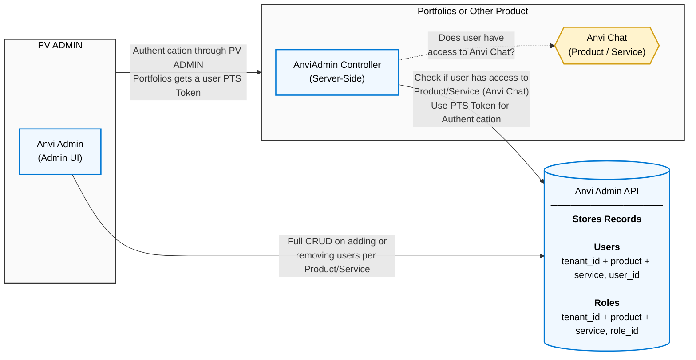
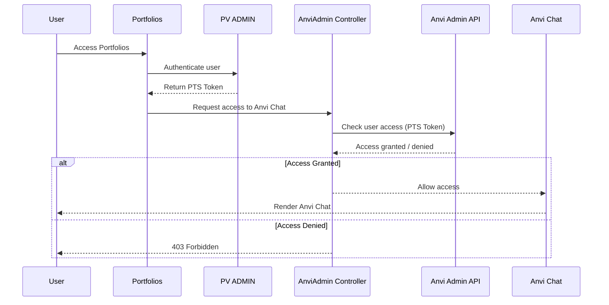

### Primary Diagram

```mermaid
flowchart LR

    %% ============================================
    %% PV ADMIN Boundary
    %% Interpreted as the outer black rectangle on
    %% the left side of the Paint diagram
    %% ============================================
    subgraph PV_ADMIN["PV ADMIN"]
        AnviAdmin["Anvi Admin<br/>(Admin UI)"]
    end

    %% ============================================
    %% Anvi Admin API — Central Data Store
    %% Represented as the large blue-bordered box
    %% at the bottom center of the Paint diagram.
    %% Using cylinder shape to indicate data storage.
    %% ============================================
    AnviAdminAPI[("Anvi Admin API<br/>─────────────────<br/><b>Stores Records</b><br/><br/><b>Users</b><br/>tenant_id + product + service, user_id<br/><br/><b>Roles</b><br/>tenant_id + product + service, role_id")]

    %% ============================================
    %% Portfolios (or other product) Boundary
    %% Interpreted as the outer black rectangle on
    %% the right side of the Paint diagram
    %% ============================================
    subgraph Portfolios["Portfolios or Other Product"]
        AnviController["AnviAdmin Controller<br/>(Server-Side)"]
        AnviChat{{"Anvi Chat<br/>(Product / Service)"}}
    end

    %% ============================================
    %% Connections
    %% ============================================

    %% Authentication flow: PV ADMIN issues a PTS Token
    %% that Portfolios uses. Interpreted as top-level
    %% arrow going left-to-right in the Paint diagram.
    PV_ADMIN -- "Authentication through PV ADMIN<br/>Portfolios gets a user PTS Token" --> Portfolios

    %% Admin UI performs full CRUD against the API
    %% to manage user-product assignments.
    AnviAdmin -- "Full CRUD on adding or<br/>removing users per Product/Service" --> AnviAdminAPI

    %% Server-side controller queries the API to check
    %% if a user has access, using the PTS Token.
    AnviController -- "Check if user has access to<br/>Product/Service (Anvi Chat)<br/>Use PTS Token for Authentication" --> AnviAdminAPI

    %% Conditional access: controller gates entry to
    %% Anvi Chat based on the API response.
    %% Using dotted arrow to indicate conditional flow.
    AnviController -. "Does user have<br/>access to Anvi Chat?" .-> AnviChat

    %% ============================================
    %% Styling
    %% Blue borders for Anvi-branded components to
    %% match the blue-bordered boxes in the Paint image.
    %% ============================================
    classDef anviBlue fill:#f0f8ff,stroke:#0078d4,stroke-width:2px,color:#000
    classDef boundary fill:#fafafa,stroke:#333,stroke-width:2px,color:#000
    classDef decision fill:#fff3cd,stroke:#d4a017,stroke-width:2px,color:#000

    class AnviAdmin,AnviController anviBlue
    class AnviAdminAPI anviBlue
    class AnviChat decision
    class PV_ADMIN,Portfolios boundary
```

```mermaid
sequenceDiagram
    participant User
    participant Portfolios
    participant PV_ADMIN as PV ADMIN
    participant AnviController as AnviAdmin Controller
    participant AnviAPI as Anvi Admin API
    participant AnviChat as Anvi Chat

    User->>Portfolios: Access Portfolios
    Portfolios->>PV_ADMIN: Authenticate user
    PV_ADMIN-->>Portfolios: Return PTS Token
    Portfolios->>AnviController: Request access to Anvi Chat
    AnviController->>AnviAPI: Check user access (PTS Token)
    AnviAPI-->>AnviController: Access granted / denied
    alt Access Granted
        AnviController-->>AnviChat: Allow access
        AnviChat-->>User: Render Anvi Chat
    else Access Denied
        AnviController-->>User: 403 Forbidden
    end
```